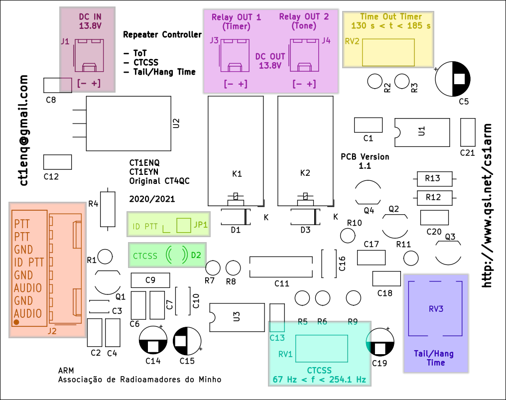
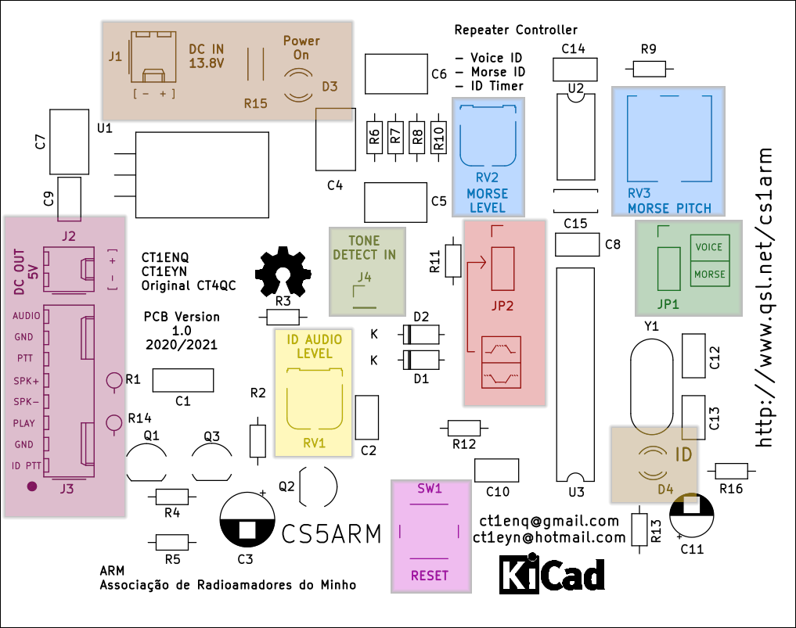
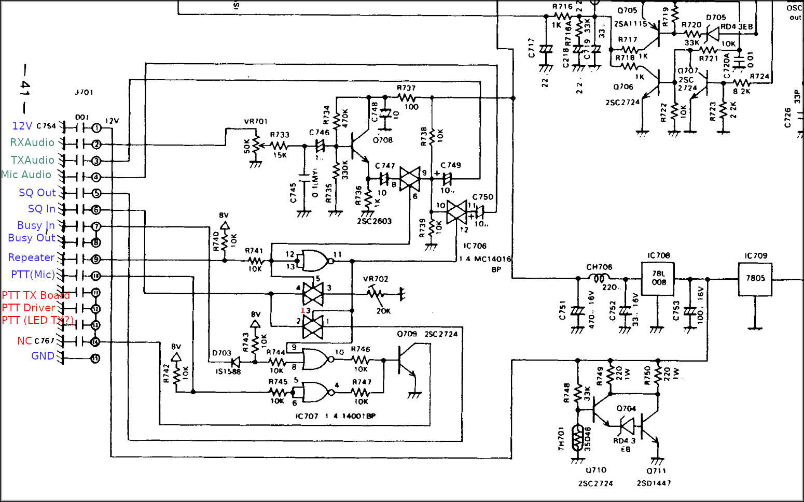
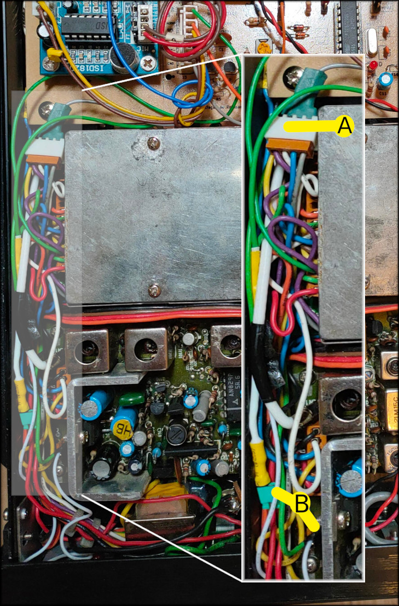
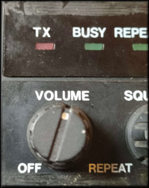
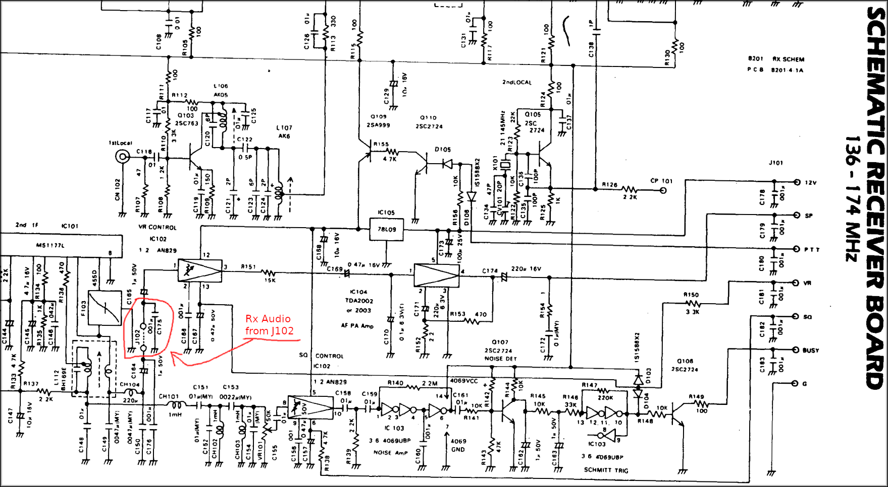
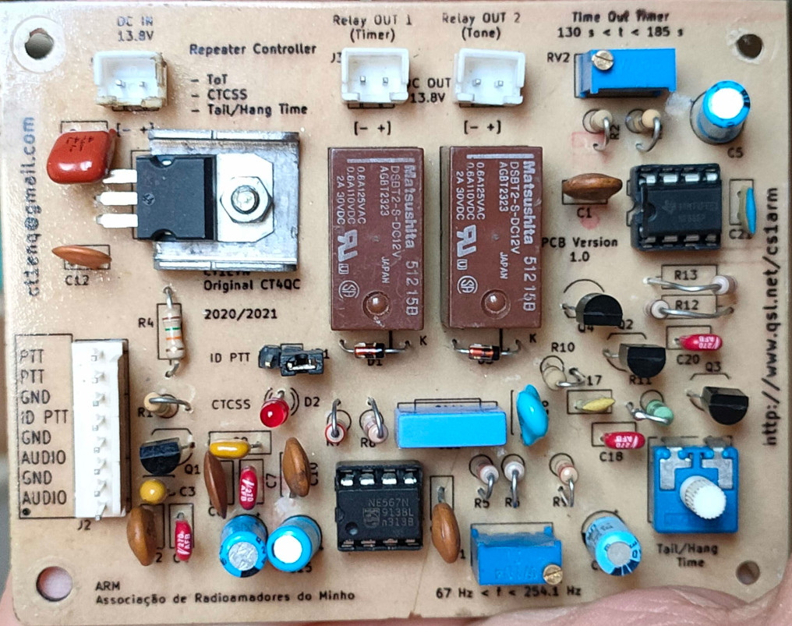
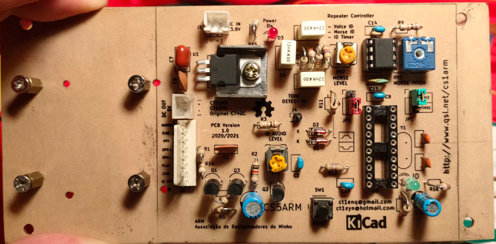

# Manual Repetidor Neutec SM-1645HS

Pequeno manual das novas funcionalidades e alterações efectuadas ao repetidor
Neutec.

## Placa de baixo

Situada na parte inferior do rádio, a placa de baixo contém o circuito de 
detecção de tom CTCSS (U3), temporizador de *timeout* (U1) e controlo de tempo
de "cauda".

Imagem com identificação das partes a explicar:

- **J1**: Alimentação 13.8V (Entrada).
- **J2**: Conjunto de 8 ligações (pino 1 com circulo preto):
 - **8** - **PTT**: Entrada/Saída de PTT
 - **7** - **PTT**: Entrada/Saída de PTT
 - **6** - **GND**: Massa
 - **5** - **ID PTT**: Entrada PTT placa de identificação (ID PTT)
 - **4** - **GND**: Massa
 - **3** - **AUDIO**: Entrada áudio
 - **2** - **GND**: Massa
 - **1** - **AUDIO**: Entrada de áudio
- **J3 e J4**: Saída de 13.8V para as ventoínhas.
 - **J3**: acompanha retransmissão (desliga com *timeout*)
 - **J4**: acompanha presença de CTCSS (mesmo após *timeout*)
- **RV1**: Sintonia do tom CTCSS (afinado para 123 Hz)
- **RV2**: Tempo de *timeout* (afinado para 3 minutos)
- **RV3**: Tempo de cauda (pequeno ajuste, não se nota devido à cauda já 
existente)
- **D2**: Led indica detecção de tom CTCSS
- **JP1**: Se colocado, permite controlo de PTT através da placa de cima (ID).

Em J2, pinos 7 e 8, sinal de PTT, um é utilizado para ligar ao PTT do rádio
e outra serve para enviar o sinal de PTT para a placa de cima. Os pinos 1 e 3
para entrada/saída de audio aplicava-se no caso do repetidor de UHF. Aqui basta
utilizar um dos pinos.

## Placa de cima

Situada na parte superior do rádio, a placa de cima contém o circuito de 
identificação do repetidor, controlado por U3 (uC at89c2051). O sinal de áudio
de morse é gerado por U2 (555) e sinal de identificação de voz é gerado por
placa externa com IC da ISD (ISD1820).

Imagem com identificação das partes a explicar:

- **J1**: Alimentação 13.8V (Entrada)
- **J2**: Saída de 5V para placa de voz (ISD1820)
- **J3**: Conjunto de 8 ligações (pino 1 com círculo preto):
 - **8**: AUDIO: Saída de sinal de áudio, voz e morse
 - **7**: GND: Massa
 - **6**: PTT: Entrada sinal PTT para detectar presença de massa via díodo
 - **5**: SPK+: Entrada *Speaker+* (ISD1820)
 - **4**: SPK-: Entrada *Speaker-* (ISD1820)
 - **3**: PLAY: Saída de disparo/trigger *Play* (ISD1820)
 - **2**: GND: Massa
 - **1**: ID PTT: Saída para controlo PTT quando há identificação
- **J4**: Liga ao relé (Tone) para detectar presença de massa via díodo
- **D3**: Led indica alimentação na placa (depois do regulador U1)
- **D4**: Led para estado de identificação:
 - **Pisca** quando pretende identificar mas não tem jumper JP1 ligado (sem
 tipo de identificação definido)
 - **Ligado** quando está no período de pré identificação, a avaliar utilização
 do repetidor
- **RV3**: Pitch/Tom do sinal de morse
- **RV2**: Volume áudio do sinal de morse
- **RV1**: Volume áudio do sinal de Voz (ISD1820)
- **SW1**: Reset/Reiniciar microcontrolador
- **JP1**: Selecciona tipo de identificação áudio
 - **1-2** : Voz
 - **2-3** : Morse
- **JP2**: Seleciona tipo de disparo/trigger ISD
 - **1-2**: Transição 0 -> 5 V (Flanco ascendente) (*Default* ISD1820)
 - **2-3**: Transição 5 -> 0 V (Flanco descendente)

## Alterações ao original

O equipamento já era repetidor de origem, embora para tal, era necessário
colocar o *Squelch* no mínimo desligando o interruptor acoplado. O Costa (CT1EYN)
fez um *bypass* e agora **o rádio está sempre em modo repetidor**, 
independentemente da posição do *Squelch* (Indicado pelo Led **Repeat**).

Dada a natureza do rádio, as alterações necessárias no próprio rádio foram
poucas e pouco intrusivas. Infelizmente o esquema não tinha referências para os
pinos da ficha *J701* (placa do receptor) e foi necessário efectuar esse 
trabalho, apresentado na imagem:

Os pinos 11 a 13 (e 14 mas está sem ligação) são o sinal de PTT para o repetidor
original (cores: cinza, branco e azul). Os fios que ligavam a estes pinos, 
juntamente com o pino 10 (violeta - PTT do microfone de mão) foram
redirecionados para uma ficha de 4 pinos que passa a controlar o PTT através da
placa de baixo, representada na figura em baixo no ponto **A**.

No ponto B está representado o ponto para ir buscar o sinal de áudio ao 
discriminador (J102) ou então ligar a um pino que foi preparado para utilizar a
saída para o auscultador externo (com jumper verde), mas aqui o volume passa a
influenciar o sinal que vai para o detector de tom. Quando o sinal está ligado
a este ponto, o volume estar na posição indicada na figura:

O J102 representado no esquema, é o sinal à saída do discriminador e é um
ligador de dois pinos (*shuntados*).

O ideal seria utilizar este ponto e evitar a influência do controlo de volume,
no entanto, sinais fracos que nem abrem o limiar do squelch podem colocar o 
repetidor no ar.

## Imagens das placas cima/baixo

### Fundo/Baixo

### Topo/Cima

## Créditos

2020/2021

- CT1ENQ (Miguel) ct1enq@gmail.com
- CT1EYN (Costa) ct1eyn@hotmail.com